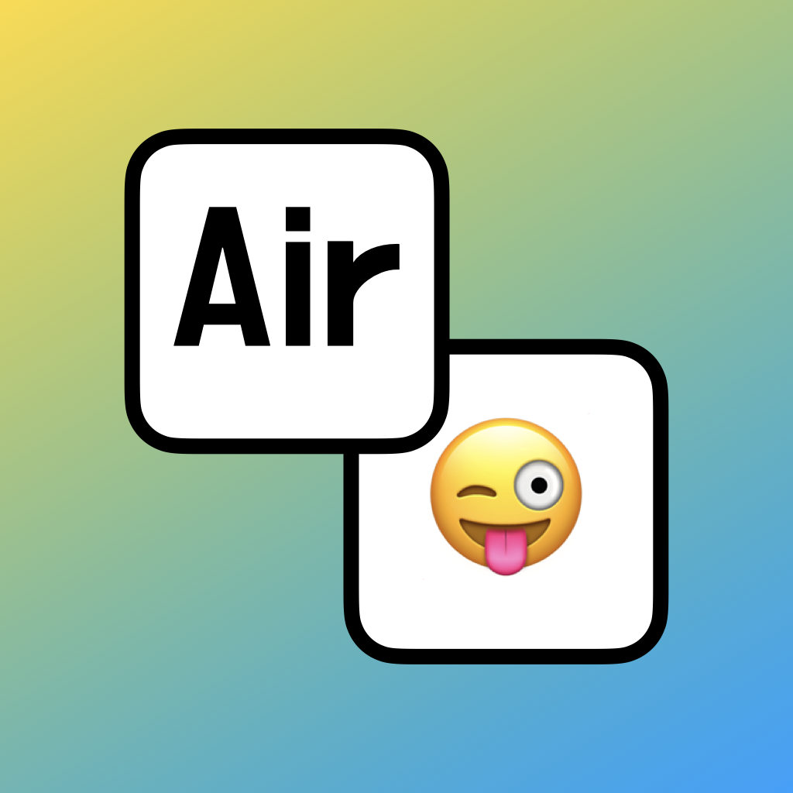

<p align="center">
  
</p>

# AirLingua

ローカル LLM を使った macOS 向け翻訳アプリ。右クリックメニューから即座に翻訳できます。

## 特徴

- **完全ローカル処理** - インターネット接続不要、プライバシー安全
- **右クリックで翻訳** - テキスト選択 → 右クリック → 「AirLingua: 日本語に翻訳」
- **メニューバー常駐** - 軽量でいつでもアクセス可能
- **複数モデル対応** - Qwen3 / TranslateGemma / ALMA / PLaMo / ELYZA

## インストール

### Homebrew

```bash
brew tap fuwasegu/tap
brew install --cask airlingua
```

### 手動インストール

[Releases](https://github.com/fuwasegu/AirLingua/releases) から最新の ZIP をダウンロードして、`AirLingua.app` を `/Applications` に移動。

## 必要条件

- macOS 14.0 (Sonoma) 以上
- llama.cpp は同梱済み（別途インストール不要）

## 使い方

1. アプリを起動（メニューバーに常駐）
2. 設定からモデルをダウンロード
3. テキストを選択して右クリック →「サービス」→「AirLingua: 日本語に翻訳」

## 対応モデル

| モデル | サイズ | ライセンス | 備考 |
|--------|--------|------------|------|
| **Qwen3-8B** | ~5.0 GB | Apache 2.0 | **推奨** - 多言語対応、高品質 |
| TranslateGemma-4B | ~2.5 GB | Gemma License | Google製 翻訳特化、55言語対応 |
| Qwen3-4B | ~2.5 GB | Apache 2.0 | 軽量版 |
| ALMA-7B-Ja | ~4.1 GB | MIT | 翻訳特化 |
| ELYZA-JP-8B | ~4.9 GB | Llama 3 | 汎用日本語モデル |
| PLaMo-2-translate | ~4.6-5.5 GB | PLaMo Community | 個人利用のみ |

## ライセンス

MIT License
