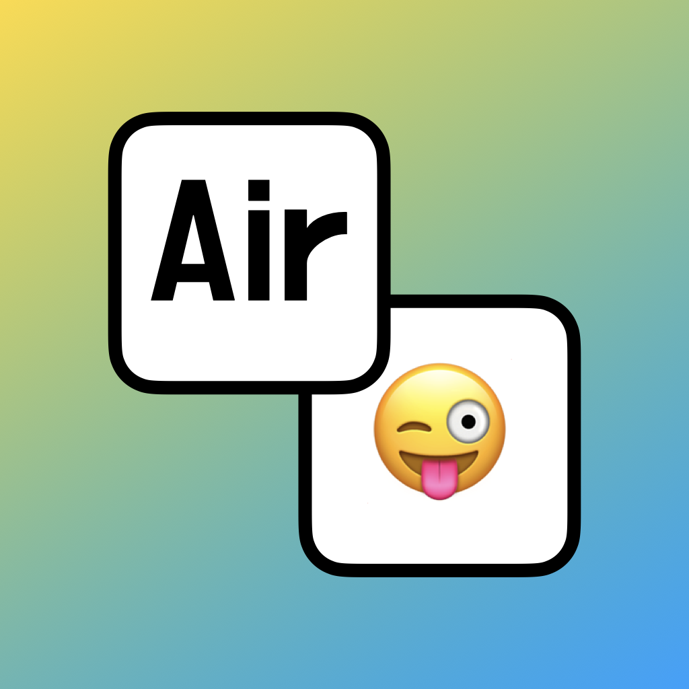

<p align="center">
  
</p>

# AirLingua

ローカル LLM を使った macOS 向け翻訳アプリ。右クリックメニューから即座に翻訳できます。

## 特徴

- **完全ローカル処理** - インターネット接続不要、プライバシー安全
- **右クリックで翻訳** - テキスト選択 → 右クリック → 「AirLingua: 日本語に翻訳」
- **メニューバー常駐** - 軽量でいつでもアクセス可能
- **複数モデル対応** - Gemma 4 / Qwen3.5 / TranslateGemma / PLaMo / ELYZA / ALMA

## インストール

### Homebrew

```bash
brew tap fuwasegu/tap
brew install --cask airlingua
```

### 手動インストール

[Releases](https://github.com/fuwasegu/AirLingua/releases) から最新の ZIP をダウンロードして、`AirLingua.app` を `/Applications` に移動。

## 必要条件

- macOS 14.0 (Sonoma) 以上
- llama.cpp は同梱済み（別途インストール不要）

## 使い方

1. アプリを起動（メニューバーに常駐）
2. 設定からモデルをダウンロード
3. テキストを選択して右クリック →「サービス」→「AirLingua: 日本語に翻訳」

## 対応モデル

| モデル | サイズ | ライセンス | 備考 |
|--------|--------|------------|------|
| **Gemma 4 E4B** | ~5.0 GB | Apache 2.0 | **推奨** - Google製 高性能汎用、140言語以上 |
| Qwen3.5-9B | ~5.9 GB | Apache 2.0 | 高品質 |
| Qwen3.5-4B | ~2.9 GB | Apache 2.0 | バランス |
| Qwen3.5-2B | ~1.3 GB | Apache 2.0 | 軽量 |
| Qwen3.5-0.8B | ~0.6 GB | Apache 2.0 | 超軽量 |
| TranslateGemma-4B | ~2.5 GB | Gemma License | Google製 翻訳特化、55言語対応 |
| PLaMo-2-translate | ~4.6-5.5 GB | PLaMo Community | PFN製 翻訳特化、個人利用のみ |
| Qwen3-8B | ~5.0 GB | Apache 2.0 | Legacy |
| Qwen3-4B | ~2.5 GB | Apache 2.0 | Legacy |
| ELYZA-JP-8B | ~4.9 GB | Llama 3 | Legacy |
| ALMA-7B-Ja | ~4.1 GB | MIT | Legacy |

## 翻訳品質比較レポート (2026-04-06)

Gemma 4 E4B の導入にあたり、既存モデルとの翻訳品質を比較した。

### テスト条件

- **量子化**: すべて Q4_K_M (GGUF)
- **比較モデル**: Gemma 4 E4B (~5.0 GB) / Qwen3.5-9B (~5.9 GB) / TranslateGemma-4B (~2.5 GB) / Qwen3.5-4B (~2.9 GB)
- **Gemma 4 E4B**: LM Studio で実行（プロンプト: 「以下の英文を日本語に翻訳してください．翻訳結果のみを返してください」）
- **それ以外**: AirLingua で実行

### Text A: 技術文書

> The garbage collector runs concurrently with the application threads, pausing them only briefly during the marking phase. This approach minimizes latency spikes at the cost of slightly higher overall CPU usage, which is an acceptable trade-off for most real-time systems.

| モデル | 翻訳結果 | 評価 |
|--------|----------|------|
| **Gemma 4 E4B** | ガベージコレクタはアプリケーションスレッドと並行して実行され、マークフェーズの間だけ短時間停止させます。このアプローチは、全体的なCPU使用率がわずかに高くなるものの、レイテンシの急上昇を最小限に抑えるため、ほとんどのリアルタイムシステムにとって許容できるトレードオフです。 | **S** - 文構造の組み替えが上手く「ものの」の接続が自然 |
| TranslateGemma-4B | ガベージコレクタは、アプリケーションのスレッドと並行して動作し、マーキングフェーズ中にスレッドをわずかに一時停止するだけです。このアプローチにより、レイテンシの急激な増加を最小限に抑えることができますが、全体的なCPU使用量はわずかに高くなります。これは、ほとんどのリアルタイムシステムにとって受け入れられるトレードオフです。 | B+ - 正確だが3文に分割され冗長 |
| Qwen3.5-9B | ごみ収集プロセスはアプリケーションスレッドと並行して実行され、マークフェーズの間にのみ一時的にスレッドを停止します。このアプローチはレイテンシスパイクを最小限に抑える一方で、全体的な CPU 使用率がわずかに高くなるという代償がありますが、多くのリアルタイムシステムにとって許容可能なトレードオフです。 | B - 「ごみ収集プロセス」は技術文書では不適切 |
| Qwen3.5-4B | (中国語で出力) | **F** - 日本語翻訳タスクとして破綻 |

### Text B: 口語表現

> I mean, it's not like I don't get where they're coming from, but at the end of the day, you can't just ship something half-baked and call it a day. That's not how any of this works.

| モデル | 翻訳結果 | 評価 |
|--------|----------|------|
| **Gemma 4 E4B** | つまり、彼らの考えが理解できないわけではないのですが、結局のところ、未完成なものを出してそれで終わりだなんてことはできません。この件はそういう仕組みではありませんから。 | **A** - 意味完璧。丁寧語で口語感はやや薄い |
| Qwen3.5-9B | つまり、彼らの気持ちも理解できるわけじゃないけど、結局のところ、未完成のものをリリースして「これで終わり」と言うのはあり得ない。そんなやり方は、この業界では通用しないんだから。 | A- - 口語感は良いが二重否定の処理ミスで**意味が逆** |
| Qwen3.5-4B | 言い換えれば、彼らの立場を理解することはできるが、結局のところ、未完成のものをそのまま提出して終わりにするのはできない。それがこの状況のあり方ではない。 | C+ - 硬すぎて口語に聞こえない |
| TranslateGemma-4B | つまり、彼らが何を言いたいのかは理解できるけど、結局のところ、粗悪なものをそのまま出して「これで終わり」とは言えない。そういうことは何も起こらない。 | C - 末尾「そういうことは何も起こらない」が**誤訳** |

### Text C: 抽象的・比喩的表現

> Privacy is not merely the absence of surveillance; it is the presence of autonomy — the quiet confidence that your thoughts remain your own until you choose otherwise.

| モデル | 翻訳結果 | 評価 |
|--------|----------|------|
| **Gemma 4 E4B** | プライバシーとは単なる監視の不在ではなく、自律性の存在です。それは、あなたが望むまで自分の考えは自分のものであるという静かな確信を意味します。 | **S** - 「あなたが望むまで」の意訳が秀逸 |
| Qwen3.5-4B | プライバシーとは、単に監視の欠如ではなく、自律の存在です——あなたが別の選択をしない限り、あなたの思考があなたのものであるという静かな自信。 | B+ - 正確だが体言止めで着地が弱い |
| TranslateGemma-4B | プライバシーとは、単に監視がないことだけではありません。それは、自律性の存在です—つまり、あなたがそうするまで、あなたの思考があなたのものであるという静かな確信のことです。 | B - 「あなたがそうするまで」が曖昧 |
| Qwen3.5-9B | プライバシーは単なる監視の不在ではなく、自律性の存在です。あなたの思考が、あなたがそう選択するまで、あなたのものであるという静かな自信です。 | B- - 「あなたの」が3回でくどい |

### 総合結果

| 順位 | モデル | サイズ | Text A | Text B | Text C | 総評 |
|------|--------|-------|--------|--------|--------|------|
| **1** | **Gemma 4 E4B** | 5.0 GB | S | A | S | 全テキストで最高評価。文の再構成力が突出 |
| 2 | Qwen3.5-9B | 5.9 GB | B | A- | B- | 口語の雰囲気は良いが、二重否定ミスと訳語ムラ |
| 3 | TranslateGemma-4B | 2.5 GB | B+ | C | B | 翻訳特化のわりに口語で誤訳。技術文書は安定 |
| 4 | Qwen3.5-4B | 2.9 GB | F | C+ | B+ | Text A で中国語出力は致命的 |

**結論**: Gemma 4 E4B は 5.0 GB のサイズでありながら、6 GB 近い Qwen3.5-9B を全カテゴリで上回った。特に「自然な日本語としての文の再構成力」が他モデルより明確に高い。

## ライセンス

MIT License
